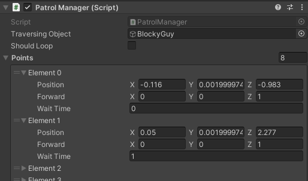
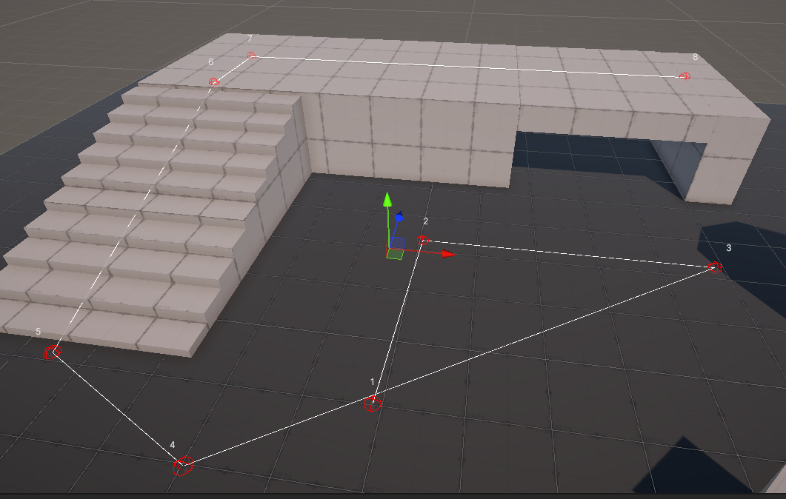

# Unity3D - AI Patrol With Widget
Using a custom editor window, one can quickly create paths for NPCs to walk on through a game enviroment in Unity.

Using Unity's Widgets, you can also visually see the path and node numbers while in the editor.

 >*These example images have a patrol that has 8 points the `traversingObject` walks to/around.*
 
 The program as well toggles a boolean within the `traversingObject`'s Animator called **"shouldMove"** to toggle its' walk animation on/off.
 
 If **"Should Loop"** is toggled off, the `traversingOject` will walk through the patrol in the opposite direction.
 *If toggled on*, the widget will show a new line connecting the ends of the patrol, showing it as a new part of the patrol path.
